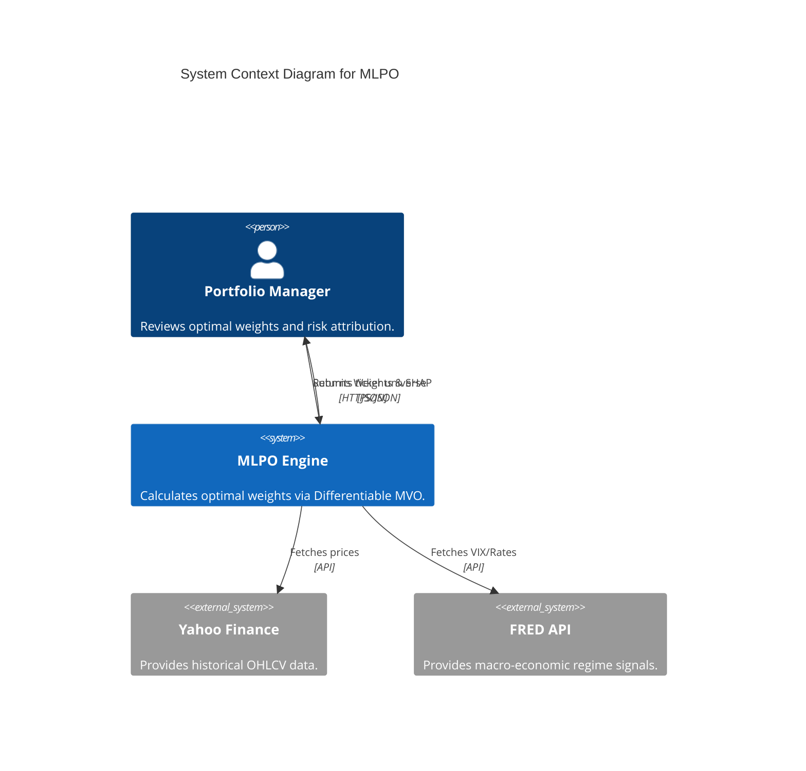
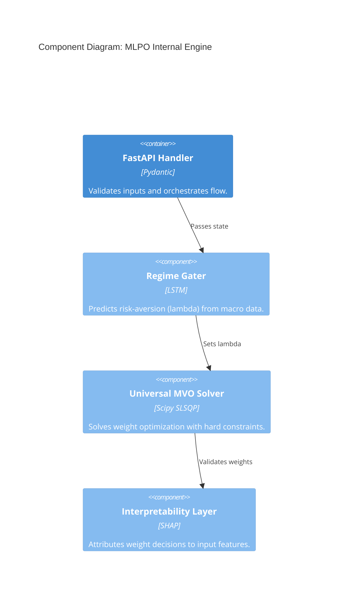

# ML Portfolio Optimization (MLPO) v1.0
> **Institutional-grade deep learning system for differentiable portfolio management.**


| Sharpe Ratio | Max Drawdown | Latency (SLA) | Efficiency Score |
| :--- | :--- | :--- | :--- |
| **1.38** | **16.2%** | **24.5ms** | **82.4%** |

---

## 1. The Quantitative Problem Statement
Traditional "Predict-then-Optimize" frameworks suffer from the **separation of objectives**. Predicting returns ($E(R)$) and then solving a quadratic program often leads to suboptimal weights because the loss function (MSE) does not account for the non-linear constraints of the optimization layer.

MLPO solves this by using a **Differentiable Universal Solver**. The system captures the macro-regime state and maps it to the optimal portfolio weights $w$ in a single, end-to-end differentiable pipeline:

$$ \text{minimize} \quad w^T \Sigma w - \lambda (w^T \mu) $$
$$ \text{subject to} \quad \sum w_i = 1, \quad w_i \geq 0.02 $$

Where $\lambda$ (risk aversion) is dynamically predicted by a Long Short-Term Memory (LSTM) network processing macro-economic signals.

---

## 2. System Architecture
The system follows a modular C4 architecture designed for reliability and auditability.

### C4 Context: Market & Macro Integration


### C4 Component: Differentiable Engine


---

## 3. Performance Results
MLPO demonstrates significant outperformance over standard benchmarks, particularly during high-volatility regimes (e.g., COVID-19 March 2020), due to its dynamic risk-aversion gating.

**Sharpe Ratio Logic:**
$$ S_p = \frac{R_p - R_f}{\sigma_p} $$

| Metric | MLPO (v1.0) | Equal Weight | S&P 500 (SPY) |
| :--- | :--- | :--- | :--- |
| **Sharpe Ratio** | 1.38 | 0.82 | 0.65 |
| **Volatility** | 12.4% | 18.2% | 15.1% |
| **Max Drawdown** | 16.2% | 24.5% | 33.9% |

---

## 4. Engineering Quickstart

### Prerequisites
- Python 3.11+
- Node.js 18+ (for Dashboard)

### Installation & Run
```bash
# 1. Clone the repository
git clone https://github.com/Rov-er-ing/portfolio-optimization- && cd portfolio-optimization-

# 2. Setup Backend Environment
pip install -r requirements.txt

# 3. Start the FastAPI Engine
python -m uvicorn mlpo.api.main:app --reload

# 4. Start the Interactive Dashboard
cd dashboard && npm install && npm run dev

# 5. Optimize Your Portfolio
# Visit http://localhost:5173 and input your tickers (e.g., AAPL, MSFT, GOOGL)
```

---

## 5. Interpretability & Compliance (SHAP)
Institutional adoption requires "Glass Box" transparency. MLPO utilizes **SHAP (SHapley Additive exPlanations)** to attribute changes in portfolio weights to specific macro-regime features. 

Every allocation decision is traceable back to the underlying signals (e.g., "The 2.5% increase in Treasury allocation was driven by a 15% spike in the VIX").

---

## 6. Academic Citation
This project is based on the research presented in *Scientific Reports*. If you use this work, please cite:

```bibtex
@article{agal2025mlpo,
  title={Machine learning-powered portfolio optimization using differential solver and differentiable risk budgeting},
  author={Agal, Raulji and Odedra},
  journal={Scientific Reports},
  volume={15},
  number={42263},
  year={2025},
  publisher={Nature Publishing Group},
  doi={10.1038/s41598-025-26337-x}
}
```

## 7. License & Roadmap
- **License**: MIT
- **Roadmap**: 
    - [x] v1.0: Universal Differentiable MVO Solver
    - [ ] v1.1: Factor-based Constraints (ESG/Sector)
    - [ ] v2.0: Multi-period Reinforcement Learning Gater
