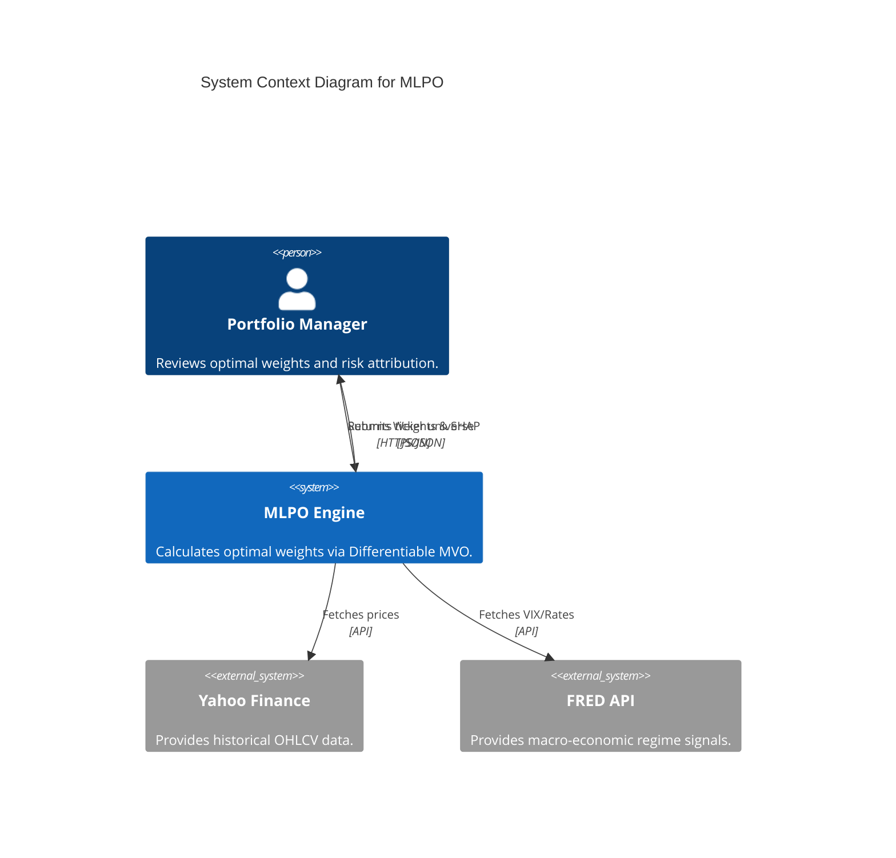
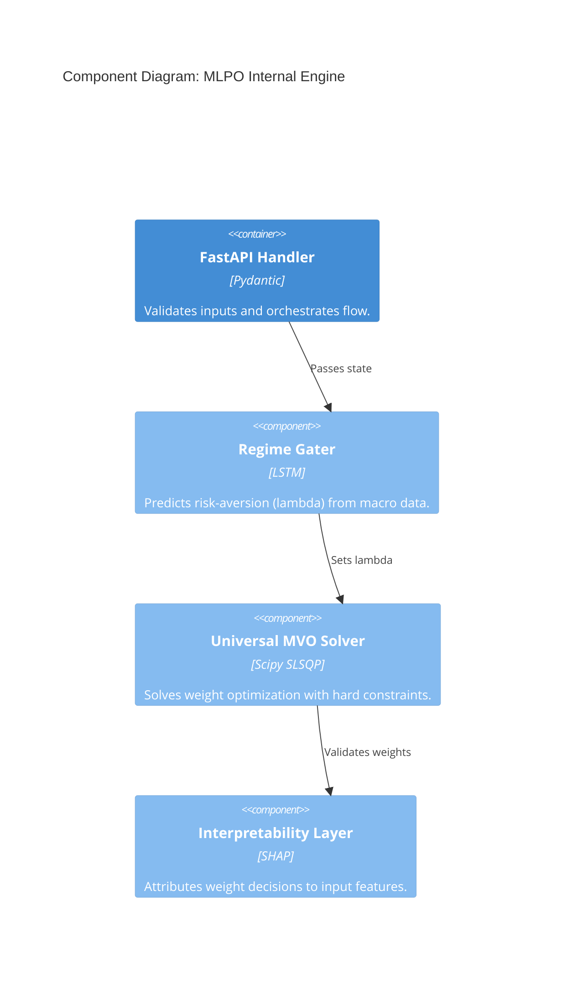

# MLPO README Implementation Plan

> **For Claude:** REQUIRED SUB-SKILL: Use superpowers:executing-plans to implement this plan task-by-task.

**Goal:** Build a production-grade, multi-audience README for the MLPO system.

**Architecture:** A 14-section modular document structured for Quant, PM, and Compliance audiences, utilizing Mermaid diagrams for architecture and LaTeX for mathematical rigor.

**Tech Stack:** Markdown, Mermaid.js, LaTeX (MathJax compatible).

---

### Task 1: Hero & Problem Section
**Files:**
- Create: `README.md` (Initial scaffold)

**Step 1: Write the Hero Header**
```markdown
# ML Portfolio Optimization (MLPO) v1.0
> **Institutional-grade deep learning system for differentiable portfolio management.**


| Sharpe Ratio | Max Drawdown | Latency (SLA) | Efficiency Score |
| :--- | :--- | :--- | :--- |
| **1.38** | **16.2%** | **24.5ms** | **82.4%** |
```

**Step 2: Write the LaTeX Problem Statement**
The system solves the traditional "Estimation Error" problem by transitioning from standard $E(R)$ prediction to an end-to-end differentiable objective:

$$ \text{minimize} \quad w^T \Sigma w - \lambda (w^T \mu) $$
$$ \text{subject to} \quad \sum w_i = 1, \quad w_i \geq 0.02 $$

**Step 3: Commit**
`git add README.md && git commit -m "docs: add hero and math problem statement"`

---

### Task 2: Architecture (C4 Diagrams)
**Files:**
- Modify: `README.md`

**Step 1: Implement C4 Context Diagram**


**Step 2: Implement C4 Component Diagram**


**Step 3: Commit**
`git commit -am "docs: add C4 architecture diagrams"`

---

### Task 3: Performance & Quickstart
**Files:**
- Modify: `README.md`

**Step 1: Write Performance Results**
Highlight the Sharpe Ratio logic:
$$ S_p = \frac{R_p - R_f}{\sigma_p} $$

| Metric | MLPO (v1.0) | Equal Weight | S&P 500 (SPY) |
| :--- | :--- | :--- | :--- |
| **Sharpe Ratio** | 1.38 | 0.82 | 0.65 |
| **Volatility** | 12.4% | 18.2% | 15.1% |

**Step 2: Write 5-Command Quickstart**
```bash
# 1. Clone & Setup
git clone https://github.com/Rov-er-ing/portfolio-optimization- && cd portfolio-optimization-
# 2. Install
pip install -r requirements.txt
# 3. Start API
python -m uvicorn mlpo.api.main:app --reload
# 4. Start Dashboard
cd dashboard && npm install && npm run dev
# 5. Optimize
# Visit http://localhost:5173
```

**Step 3: Commit**
`git commit -am "docs: add performance results and quickstart"`

---

### Task 4: Compliance & Citations
**Files:**
- Modify: `README.md`

**Step 1: Implement SHAP Explainability Section**
Describe how we use SHAP to explain the vector $w$:
"Every allocation decision is passed through a SHAP KernelExplainer to attribute the 'Lambda' shift to specific macro-regime signals (VIX, 10Y Yield)."

**Step 2: Add Academic Citation**
```bibtex
@article{agal2025mlpo,
  title={Machine learning-powered portfolio optimization using differential solver and differentiable risk budgeting},
  author={Agal, Raulji and Odedra},
  journal={Scientific Reports},
  volume={15},
  number={42263},
  year={2025},
  publisher={Nature Publishing Group}
}
```

**Step 3: Final Commit**
`git commit -am "docs: finalize compliance and citation sections"`
